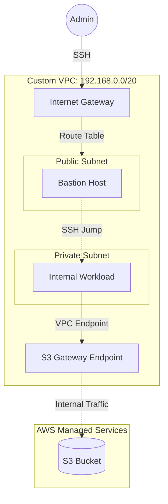

# AWS VPC Networking Fundamentals (Lab)

## 🧐 About This Project

This repository documents a **hands-on laboratory exercise** to understand core AWS networking concepts. 
The goal was to manually architect a secure, segmented network environment from scratch to understand the underlying "plumbing" of AWS before moving to Infrastructure as Code.

> **Note:** This project utilizes "ClickOps" (Manual Console Configuration) deliberately for educational purposes.

## 🏗️ Lab Architecture (Simplified View)

## 📂 Repository Structure

* `docs/setup-guide.md`: Detailed step-by-step documentation.
* `scripts/verify_connectivity.sh`: Bash script to validate network isolation.
* `examples/*.json`: Reference JSON structures for security groups.

## 💡 Key Concepts Learned

* **CIDR Planning:** Designed a non-overlapping IP range (`192.168.0.0/20`) to allow future peering.
* **Traffic Flow:** Managed Route Tables to strictly separate Public (IGW) and Private traffic.
* **Security:** Implemented the Bastion Host pattern using specific Security Group referencing.
* **Private Connectivity:** Configured **VPC Gateway Endpoints** to access S3 without a NAT Gateway.

---

## 👨‍💻 Author

**Sagi Matias** ([@sagimatias25](https://github.com/sagimatias25))

Part of my DevOps learning journey.
**Status:** ✅ Completed (Jan 2026) | **Next:** Converting to Terraform
