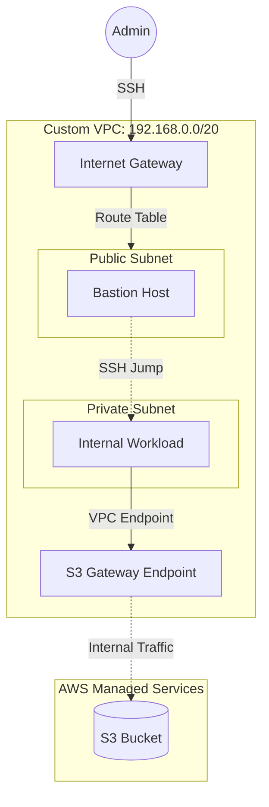

# AWS VPC Networking Fundamentals (Lab)

## Project Overview

This repository documents a hands-on laboratory exercise designed to implement core AWS networking concepts. 
The objective was to manually architect a secure, segmented network environment from scratch to understand the underlying infrastructure before transitioning to Infrastructure as Code (IaC).

> **Note:** This project utilizes "ClickOps" (Manual Console Configuration) deliberately for educational purposes.

## Architecture

## Repository Structure

* `docs/setup-guide.md`: Detailed step-by-step documentation of the configuration.
* `scripts/verify_connectivity.sh`: Bash script used to validate network isolation and S3 access.
* `examples/*.json`: Reference JSON structures for security groups.

## ⚖️ Production Considerations (The "What Ifs")

This lab implements a **Single-AZ** architecture for simplicity. In a real-world production environment, the following changes would be mandatory to ensure High Availability (HA) and resilience:

1.  **Multi-AZ Deployment:** Mirroring the Public/Private subnets across at least 2 Availability Zones (e.g., `us-east-1a` and `us-east-1b`) to survive a data center failure.
2.  **Load Balancing:** Implementing an Application Load Balancer (ALB) in the Public subnets to distribute traffic.
3.  **Auto Scaling:** Replacing standalone EC2 instances with Auto Scaling Groups (ASG) for self-healing.
4.  **NACLs (Network ACLs):** Utilizing Stateless NACLs as an additional defense layer at the subnet boundary (e.g., for blocking specific malicious IP ranges), essentially acting as a firewall for the subnet itself.

---

## Author

**Sagi Matias** ([@sagimatias25](https://github.com/sagimatias25))

Part of my DevOps learning journey.
**Status:** Completed (Feb 2026) | **Next Step:** Converting to Terraform
