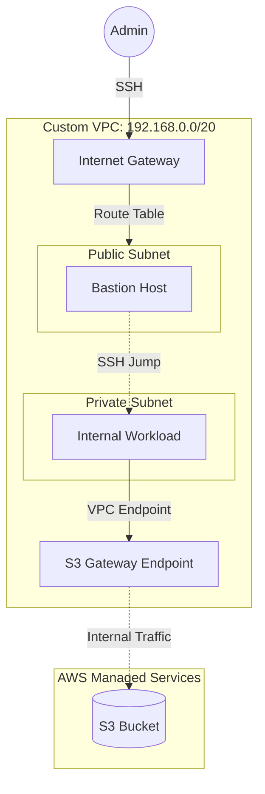

# AWS VPC Networking Fundamentals (Lab)

## Project Overview

This repository documents a hands-on laboratory exercise designed to implement core AWS networking concepts. 
The objective was to manually architect a secure, segmented network environment from scratch to understand the underlying infrastructure before transitioning to Infrastructure as Code (IaC).

> **Note:** This project utilizes "ClickOps" (Manual Console Configuration) deliberately for educational purposes.

## Architecture

## Repository Structure

* `docs/setup-guide.md`: Detailed step-by-step documentation (Network, IAM, Routing).
* `scripts/verify_connectivity.sh`: Robust Bash script to validate network isolation.
* `scripts/apply_security_groups.sh`: Utility to apply the JSON configurations via AWS CLI.
* `examples/*.json`: Reference JSON structures for security groups.

## ⚖️ Production Considerations (The "Gap Analysis")

This lab represents a foundational setup. To meet **Production Standards** in a modern enterprise environment (like Google/AWS), the following upgrades are mandatory:

1.  **Eliminate SSH Bastions (Modern Access):** * Replace the Bastion Host with **AWS Systems Manager (SSM) Session Manager**.
    * **Why:** This removes the need for open Port 22, manages access via IAM policies, and provides full session logging.

2.  **Observability & Auditing:**
    * Enable **VPC Flow Logs** (sending to CloudWatch or S3).
    * **Why:** Without logs, debugging dropped packets or investigating security incidents in an isolated network is impossible.

3.  **High Availability (HA):**
    * Deploy across Multi-AZs (e.g., `us-east-1a` + `us-east-1b`) with an Application Load Balancer.

4.  **Identity Management:**
    * Enforce **Least Privilege** on IAM Roles (e.g., restrict S3 access to a specific bucket ARN instead of `AmazonS3ReadOnlyAccess`).

---

## Author

**Sagi Matias** ([@sagimatias25](https://github.com/sagimatias25))

Part of my DevOps learning journey.
**Status:** Completed (Feb 2026) | **Next Step:** Converting to Terraform
