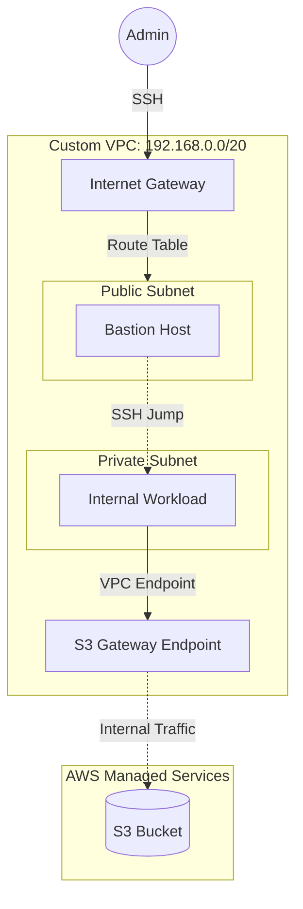

# AWS VPC Networking Fundamentals (Lab)

## Project Overview

This repository documents a hands-on laboratory exercise designed to implement core AWS networking concepts. 
The objective was to manually architect a secure, segmented network environment from scratch to understand the underlying infrastructure before transitioning to Infrastructure as Code (IaC).

> **Note:** This project utilizes "ClickOps" (Manual Console Configuration) deliberately for educational purposes.

## Architecture

## Repository Structure

* `docs/setup-guide.md`: Detailed step-by-step documentation of the configuration.
* `scripts/verify_connectivity.sh`: Bash script used to validate network isolation and S3 access.
* `examples/*.json`: Reference JSON structures for security groups.

## Key Concepts

* **CIDR Planning:** Designed a non-overlapping IP range (`192.168.0.0/20`) to allow future peering.
* **Traffic Flow:** Managed Route Tables to strictly separate Public (IGW) and Private traffic.
* **Security:** Implemented the Bastion Host pattern using specific Security Group referencing.
* **Private Connectivity:** Configured **VPC Gateway Endpoints** to access S3 without a NAT Gateway.

---

## Author

**Sagi Matias** ([@sagimatias25](https://github.com/sagimatias25))

Part of my DevOps learning journey.
**Status:** Completed (Feb 2026) | **Next Step:** Converting to Terraform
